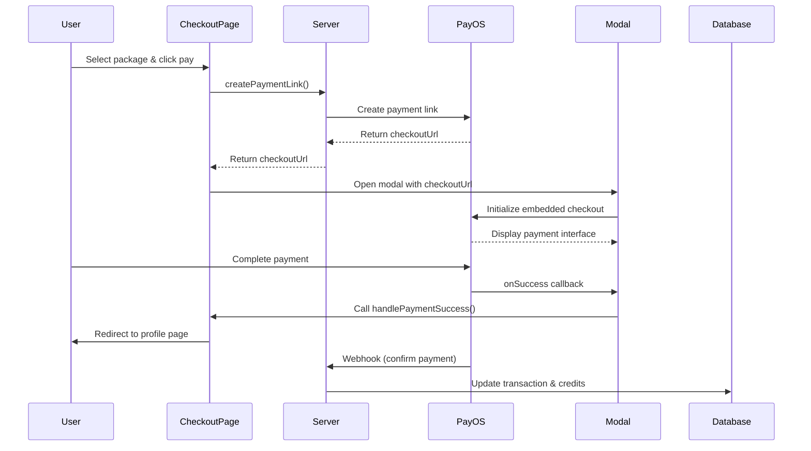

# Embedded Payment Implementation Guide

## Overview

The payment flow has been updated to use PayOS embedded checkout, which displays the QR code and payment interface directly within your application instead of redirecting users to an external page.

## What Changed

### 1. **Added PayOS Checkout Script** (`src/app/layout.tsx`)
- Added the PayOS CDN script to the root layout:
  ```html
  <script src="https://cdn.payos.vn/payos-checkout/v1/stable/payos-initialize.js" async></script>
  ```
- This makes the PayOS checkout library available globally throughout the app

### 2. **Created TypeScript Declarations** (`src/types/payos.d.ts`)
- Added type definitions for the PayOS checkout library
- Provides IntelliSense and type safety when using PayOS functions
- Defines interfaces for:
  - `PayOSConfig`: Configuration object for payment initialization
  - `PayOSCheckoutInstance`: Methods returned by `usePayOS()` hook
  - Event types for success, cancel, and exit callbacks

### 3. **Built Embedded Payment Modal Component** (`src/components/payment/EmbeddedPaymentModal.tsx`)
- A reusable React component that handles the embedded payment flow
- Key features:
  - **Modal Display**: Shows payment UI in a modal overlay
  - **Embedded Iframe**: Uses PayOS's embedded mode instead of redirecting
  - **Event Handling**: Listens for payment success/cancel/exit events
  - **Order Details**: Displays a summary of the purchase
  - **Auto-cleanup**: Properly closes payment session on unmount

#### Component Props:
```typescript
interface EmbeddedPaymentModalProps {
  isOpen: boolean;              // Controls modal visibility
  onClose: () => void;          // Callback when modal is closed
  checkoutUrl: string | null;   // PayOS checkout URL from server
  onSuccess?: () => void;       // Callback on successful payment
  onCancel?: () => void;        // Callback when payment is cancelled
  orderDetails?: {              // Optional order summary
    packageName: string;
    amount: number;
    credits: number;
  };
}
```

### 4. **Updated Checkout Page** (`src/app/checkout/page.tsx`)
- Modified `handlePurchase()` function to use embedded modal instead of redirect
- Added state management for:
  - `isPaymentModalOpen`: Controls modal visibility
  - `checkoutUrl`: Stores the PayOS checkout URL
  - `orderDetails`: Stores purchase information for display
- Added callback handlers:
  - `handlePaymentSuccess()`: Redirects to profile page after successful payment
  - `handlePaymentCancel()`: Resets state when payment is cancelled

## How It Works

### User Flow:

1. **User selects a credit package** (or enters custom amount)
2. **Clicks "Tiếp tục thanh toán"** button
3. **Server creates payment link** via `createPaymentLink()` action
4. **Embedded modal opens** displaying the PayOS checkout interface
5. **User scans QR code** or completes payment within the modal
6. **PayOS triggers callback**:
   - `onSuccess`: Payment completed → redirect to profile
   - `onCancel`: Payment cancelled → close modal
   - `onExit`: User closed modal → cleanup state
7. **Webhook confirms payment** on the server (existing flow unchanged)

### Technical Flow:



## Key Features

### ✅ No External Redirects
- Users stay on your website throughout the payment process
- Better user experience and brand consistency

### ✅ Real-time Feedback
- Modal displays order details
- Shows payment status updates
- Provides success/error messages

### ✅ Mobile-Friendly
- Responsive modal design
- QR code scanning works seamlessly on mobile devices

### ✅ Security Maintained
- Still uses webhook verification for actual credit grants
- Frontend events are for UX only (not trusted for credit updates)
- Same security model as before

## Important Security Notes

### ⚠️ Trust Only the Webhook

The embedded payment modal provides a better user experience, but **you must still rely on the webhook for payment confirmation**:

1. **Frontend callbacks (`onSuccess`)**: Used for UX (closing modal, showing messages)
2. **Webhook verification**: The **only** source of truth for granting credits

A malicious user could fake the `onSuccess` callback, but they cannot fake the webhook signature verification. The server-side webhook handler remains unchanged and continues to be the secure way to confirm payments.

### Current Security Flow:

```typescript
// ❌ DO NOT grant credits here (can be faked)
onSuccess: () => {
  console.log("Payment successful");
  window.location.href = "/profile?payment=success";
}

// ✅ Grant credits only in webhook handler (verified signature)
// src/app/api/webhook/payos/route.ts
const verifiedData = payOS.verifyPaymentWebhookData(webhookBody);
if (verifiedData.status === 'PAID') {
  await addCreditsToUser(userId, credits); // Safe!
}
```

## Testing the Implementation

### 1. **Test Embedded Modal**
```bash
npm run dev
```
- Navigate to `/checkout`
- Select a package and click "Tiếp tục thanh toán"
- Verify the modal opens with PayOS checkout interface

### 2. **Test Payment Flow**
- Complete a test payment using PayOS test credentials
- Verify the modal closes on success
- Check that you're redirected to `/profile?payment=success`
- Confirm credits are added via webhook

### 3. **Test Error Handling**
- Click close button → modal should close
- Cancel payment → `onCancel` callback should fire
- Check console for any JavaScript errors

## Customization Options

### Modal Styling
Edit `src/components/payment/EmbeddedPaymentModal.tsx`:
```tsx
// Change modal size
<div className="relative w-full max-w-2xl"> // ← Adjust max-width

// Change container height
<div id={containerIdRef.current} 
     className="min-h-[500px] w-full ..."> // ← Adjust min-height
```

### Success Behavior
Edit `src/app/checkout/page.tsx`:
```tsx
const handlePaymentSuccess = () => {
  // Option 1: Redirect to profile
  window.location.href = "/profile?payment=success";
  
  // Option 2: Show success message and stay on page
  // setError(null);
  // alert("Thanh toán thành công! Credits đã được thêm vào tài khoản.");
  
  // Option 3: Reload current page to refresh data
  // window.location.reload();
};
```

### Callbacks
You can add more callbacks to the PayOS config:
```tsx
const config = {
  RETURN_URL: window.location.href,
  ELEMENT_ID: containerIdRef.current,
  CHECKOUT_URL: checkoutUrl,
  embedded: true,
  onSuccess: (event) => { /* ... */ },
  onCancel: (event) => { /* ... */ },
  onExit: (event) => { /* ... */ },
  // Add custom callbacks
  onLoad: () => {
    console.log("Payment interface loaded");
  },
};
```

## Troubleshooting

### Modal doesn't open
- **Check console**: Look for "Failed to initialize PayOS checkout" errors
- **Verify script loaded**: Check that PayOS script is in network tab
- **Check checkoutUrl**: Ensure it's a valid PayOS URL

### Payment doesn't complete
- **Check webhook**: Verify webhook endpoint is publicly accessible
- **Check logs**: Look for webhook verification errors in server logs
- **Test webhook**: Use PayOS dashboard to test webhook URL

### TypeScript errors
- **Restart TypeScript**: Run "TypeScript: Restart TS Server" in VS Code
- **Check types**: Ensure `src/types/payos.d.ts` exists
- **Clear cache**: Delete `tsconfig.tsbuildinfo` and restart

## Migration Notes

### Before (External Redirect):
```tsx
if (result.success && result.checkoutUrl) {
  window.location.href = result.checkoutUrl; // ❌ Redirects away
}
```

### After (Embedded Modal):
```tsx
if (result.success && result.checkoutUrl) {
  setOrderDetails({ packageName, amount, credits });
  setCheckoutUrl(result.checkoutUrl);
  setIsPaymentModalOpen(true); // ✅ Opens modal
}
```

## References

- [PayOS Embedded Integration Guide](./casso-payment-intergation.md)
- [PayOS Official Documentation](https://payos.vn/docs)
- [PayOS JavaScript SDK](https://github.com/payOSHQ/payos-checkout-js)

## Summary

The embedded payment flow provides a seamless checkout experience while maintaining the same security guarantees. Users can complete payments without leaving your application, improving conversion rates and user satisfaction. The webhook-based verification ensures that credits are only granted for legitimate, verified payments.
